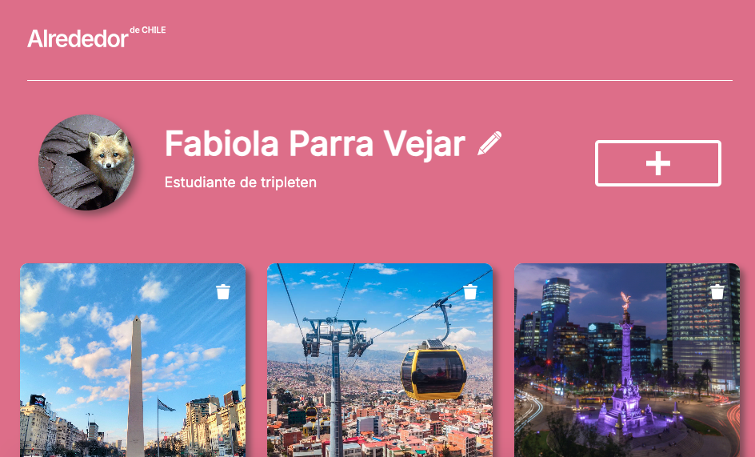
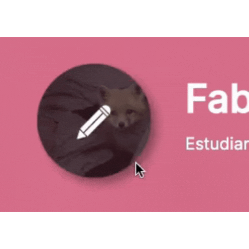
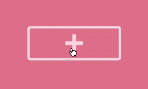

# Proyecto 9: Página web "Alrededor de Chile"

La página web "Alrededor de Chile" es el proyecto del curso de Desarrollo Web de Tripleten que abarca desde el Sprint 5 hasta el término curso. Es una sitio que muestra imágenes del país, dando la opción de modificar el perfil, añadir nuevas fotos a la galería o eliminarlas.
En esta fase, el enfoque está puesto en Javascript y la refactorización del código creado en el sprint 5, con enfoque en programación orientada a objetos.

# URL de la página: https://fabi-parra.github.io/web_project_around/

## Las principales secciones de la página son:

1. Encabezado: cuenta con un logo.
2. Perfil: sección que muestra una fotografía del usuario su nombre y su ocupación, además de un botón que abre un popup con formulario, permitiendo modificar esta información (nombre y descripción).
3. Ventanas emergentes: 2 botones permiten la apertura de 2 ventanas emergentes con formularios, uno para modificar el perfil de usuario y otro para añadir nuevas tarjetas. Los botones para el envío de estos formularios permanecen inactivos mientras no se completen los campos de la forma que la validación exige.
4. Tarjetas de imágenes: colección de tarjetas, creadas a través de instancias de la clase Card,dispuestas en un grid. Las tarjetas se componen de una fotografía, título y 2 botones, uno que permite dar "me gusta" y otro que permite eliminar la tarjeta.

### Características del proyecto

Para la creación de esta página se aplicaron los conocimientos obtenidos hasta ahora en el curso, con énfasis en Javascript, validación de formularios y programación orientada a objetos. A continuación se realiza una descripción:

- Aplicación de conocimientos de Javascript para crear cuadros emergentes que se cierran en todas las resoluciones de pantalla, dando clic en el icono, apretando escape o haciendo clic fuera del popup.
- Refactorización del código anterior con enfoque en programación orientada a objetos. Se crean 3 clases adicionales a FormValidator y Card, que realizan funciones específicas, tanto para abrir y cerrar los popups, como para modificar el perfil, añadir nuevas cartas y renderizar todos los elementos en la página.
- Modificación de la clase Card con base en programación orientada a objetos. Se conecta esta clase al popup con el formulario para crear tarjetas. Además, se conecta con una función que abrirá el popup al dar clic en la fotografía de cada tarjeta.
- Javascript, HTML y CSS para la validación de los 2 formularios incorporados hasta el momento.
- Uso de estructura de archivos plana de BEM: los archivos de estilos se organizan en bloques de acuerdo con la metodología BEM. Cada bloque cuenta con sus estilos y se importan a un único archivo, index.css, mediante el método @import. Se vincula este archivo CSS raíz al archivo HTML.
- Instalación de fuentes directamente en el proyecto, mediante @font-face.
- HTML SEMÁNTICO: uso de etiquetas semánticas para definir la estructura de las principales secciones de la página (header, main y footer), así como para artículos, enlaces, imágenes y elementos de texto.
- CSS.
- Grid layout.
- Uso de media queries.
- Flexbox básico y avanzado.

#### Video demostrativo del proyecto

##### Gifs del proyecto

###### Capturas de pantalla del proyecto

